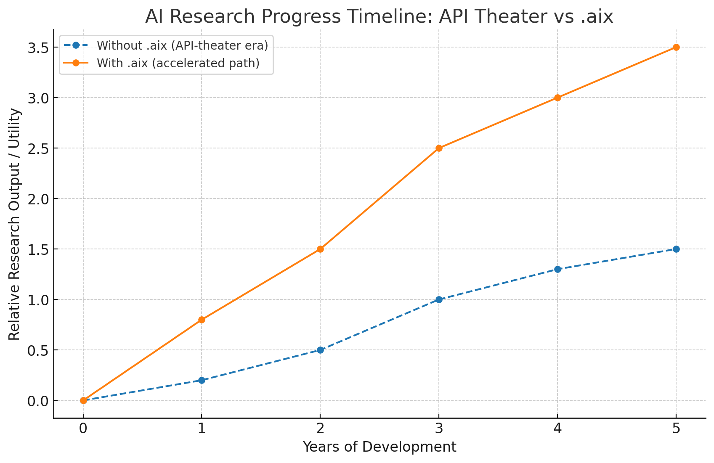

# Agentic AI: What’s Missing (and How to Fix It)

*Everyone is hyping “Agentic AI.” Here’s what’s actually missing — and how to fix it.*  

---

## 🚨 The Problem
Everyone is talking about “Agentic AI.”  
IBM, OpenAI, Anthropic, xAI, and others are pitching it as the future.  

But look closer: today’s “agents” are **just API wrappers** —  
report writers, workflow scripts, or fancy demos.  

What’s missing?  
- **No hardened execution layer** – jobs run on generic GPUs with no client isolation.  
- **No scoped memory** – agents leak context, hallucinate, and drift.  
- **No signed execution format** – nothing verifiable, reproducible, or auditable.  
- **No compliance path** – auditors can’t replay or prove safety.  

All of these are **infrastructure problems**, not prompt problems.  

Without solving them, “Agentic AI” stays stuck in marketing theater — not infrastructure.  

---

## ✅ The Solution
We need an **execution framework** that makes agents **safe, portable, and auditable**.  

Call it `.aix` — an execution file for AI.  

Core components:  
1. **Isolated GPU Cells** – per-client hardened compute zones.  
2. **.aix Runtime Verifier** – checks signatures, licenses, policies, and data scopes.  
3. **Scoped Memory Capsules** – with TTLs, trust weights, and provenance graphs.  
4. **Evidence Bus & Audit Ledger** – machine-readable proof of what ran, when, and how.  
5. **Policy Engine** – enforce safelists/deny-lists for models, APIs, and tools.  

This isn’t theory — it’s a roadmap.  

---

## AI Research Progress Timeline: API Theater vs `.aix`

The chart below is a **theoretical model**, generated to illustrate expected research acceleration with `.aix`.  
It was created with the help of ChatGPT pattern-matching, based on known inefficiencies of API-theater workflows and the improvements `.aix` introduces.  
While illustrative, the trends reflect real pain points in current AI research pipelines.  

  

*Figure 1. Theoretical projection based on ChatGPT-assisted pattern-matching of known bottlenecks (API orchestration, reproducibility, portability) vs expected improvements with `.aix` execution. This is an illustrative model, not experimental data.*  

### Why `.aix` Accelerates Research
- **API Overhead Removed** – no need to rebuild orchestration wrappers for every experiment.  
- **Reproducibility** – `.aix` containers preserve inputs, outputs, and scoped memory, making results auditable and shareable.  
- **Scoped Memory** – prevents identity drift and hallucinations, cutting debugging cycles.  
- **Cross-Model Portability** – run the same `.aix` file across OpenAI, Anthropic, Grok, or local GPUs.  
- **Parallel Agents** – synchronization via `.aixnet` enables multiple models to work together efficiently.  

📌 *Takeaway*: Without `.aix`, progress is linear and bottlenecked by APIs. With `.aix`, progress compounds faster as experiments become portable, auditable, and parallelizable.  

---

## 🛠️ Roadmap (Estimated)

**Phase 0 (2–4 weeks):**  
- Stand up a “Gold Cell” (isolated GPU enclave with hardened security).  
- Deploy `.aix verifier` with signed execution + basic audit logging.  
- Run initial use cases (RAG, report generation) end-to-end inside the enclave.  

**Phase 1 (4–8 weeks):**  
- Add **scoped memory capsules** (TTL, trust weights, provenance).  
- Introduce compliance policy packs (HIPAA, GxP).  
- Provide **per-run attestation proofs** exportable for audits.  
- Release a developer CLI for `.aix lint/validate` so teams can pre-check bundles locally.  

**Phase 2 (Quarter):**  
- Expand to multi-region deployment with HA schedulers and burst queues.  
- Launch a **marketplace for signed `.aix packs`** (ETL, QC, validation, safety workflows).  
- Offer **Compliance Compute SLAs**: GPU hour + attestation + evidence bundle.  
- *(At this stage, if a major partner collaborates — IBM, OpenAI, xAI, Nvidia, or DARPA — rollout accelerates dramatically.)*  

---

## 🧭 Why It Matters
- **For IBM:** Move beyond “workflow theater” to own the runtime layer regulators actually care about.  
- **For OpenAI / Anthropic:** Prove agents can be governed, not just demoed. This is the leap from chatbot hype to enterprise trust.  
- **For xAI / Nvidia:** Safe GPU enclaves + `.aix` = compliance fortress + first-mover advantage in regulated industries.  
- **For Startups & Academia:** Lower the barrier to entry. Portable, reproducible experiments accelerate innovation without enterprise-scale infra.  
- **For Regulators:** Finally, a format you can audit, replay, and certify — turning AI compliance from “black box” into an evidence-based process.  

Without this, “Agentic AI” stays in demo-land.  
With this, it becomes deployable infrastructure.  

---

## 📢 Call to Action
This roadmap is being released into the **public domain** — because without `.aix`-style infrastructure, “Agentic AI” will never scale safely.  

No gatekeeping. If you’re building agents, **take this blueprint and run with it**.  

⚠️ **Note:** Core patents on `.aix` usage and execution have been filed — to prevent enclosure, not to block adoption.  

This project wasn’t born out of luxury or hype.  
The inventor was **backed into a corner** by a broken system and did the only thing left —  
**invent and patent his way out.**  

This repo is a **free roadmap**, not a waiver of IP rights.

The industry doesn’t need more hype. It needs **execution standards** that regulators, enterprises, and engineers can trust.  

🤝 **Partnerships:** `.aix` is actively seeking collaborators and strategic partners to help build, test, and deploy this infrastructure at scale. If you’re IBM, OpenAI, xAI, Nvidia, DARPA — or any group serious about safe agentic AI — let’s talk.  

---

## ⚡ License (Roadmap Only)
MIT License. Free to use, free to adapt.  
Just don’t call report-writing “agentic.” 😉  

This repo is a **roadmap**, released openly in the hope that someone will pick it up and build.  
The first group to execute this correctly could become the **market leader** in true Agentic AI infrastructure.  

⚠️ Note: This license applies only to the **roadmap content in this repository**.  
`.aix` itself has **core patents filed** on usage and execution — those rights remain reserved.  
This repo = free roadmap. `.aix` = protected infrastructure.  

---

📂 **Reference Implementation**  
The detailed `.aix` file specification is already public here:  
👉 [github.com/mjtiv/aix-file-format](https://github.com/mjtiv/aix-file-format)  

This repo is the **call-out**.  
That repo is the **blueprint**.  

---

*Agents don’t need more demos — they need standards. `.aix` shows the path forward.*  

